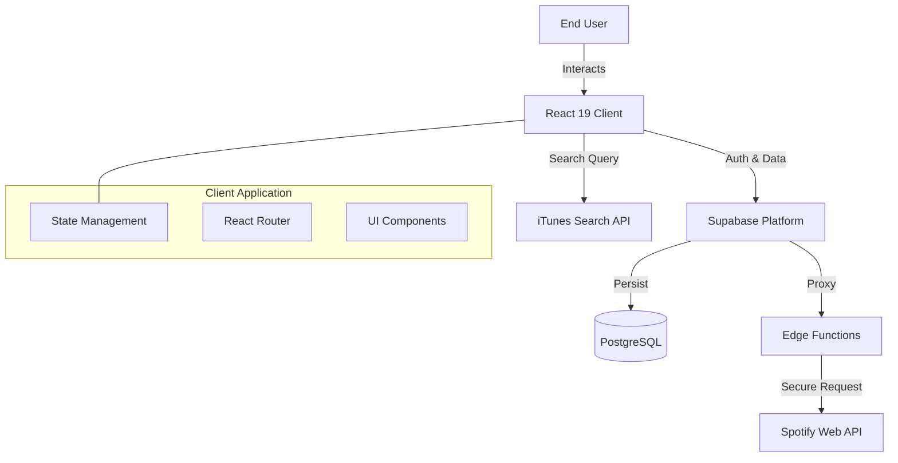

# Music Playlist App (Spotify-like Experience)

[](https://github.com/sirawichz/Music_playlist)
[](https://opensource.org/licenses/MIT)
[](https://react.dev)
[](https://vitejs.dev)
[](https://supabase.com)

> **A scalable, production-ready music playlist management system offering a premium "Spotify-like" user experience.**

[🇹🇭 ไปที่เวอร์ชันภาษาไทย (Thai Version)](#-เวอร์ชันภาษาไทย)

---

## � Table of Contents

- [Overview](#-overview)
- [Key Features](#-key-features)
- [Tools & Technologies](#-tools--technologies)
- [System Architecture](#-system-architecture-how-things-work)
- [Setup & Deployment](#-how-to-setup)
  - [With Docker Compose](#with-docker-compose)
  - [With Kubernetes (Helm)](#with-kubernetes-helm)
- [Notes & References](#-notes--references)

---

## 🔭 Overview

In the modern web ecosystem, building a responsive and seamless media application requires a robust architecture that balances client-side performance with secure server-side operations. **Music Playlist App** solves the challenge of fragmented music discovery by integrating the **iTunes Search API** for rapid content retrieval with a **Supabase** backend for persistent user libraries.

Reliability and User Experience are paramount. This system implements **Optimistic UI Updates** to ensure instant feedback during playlist operations and utilizes a **Secure Edge Proxy** pattern to handle external API credentials, mitigating security risks common in SPA architectures.

---

## ✨ Key Features

- **⚡ Instant Search Engine**: Utilizing `lodash.debounce` to efficiently query the iTunes API without hitting rate limits, providing real-time search results and 30-second audio previews.
- **🎧 Seamless Playback Controller**: A global state-managed player (powered by Zustand 5) that maintains playback continuity across route navigations/page changes.
- **📂 Smart Library Management**: Full CRUD capabilities (Create, Read, Update, Delete) with Optimistic UI updates, ensuring a "native-app" responsiveness even on slower networks.
- **🛡️ Secure Edge Gateway**: Sensitive operations and token exchanges are offloaded to Supabase Edge Functions, preventing Client Secret exposure.

---

## 🛠 Tools & Technologies

| Category | Technologies |
|----------|--------------|
| **Core** |    |
| **Styling** |   |
| **State** |  |
| **Backend** |   |
| **DevOps** |   |

---

## 🏗 System Architecture (How things work)

The system follows a modern **Client-Serverless** architecture. The React frontend interacts directly with high-performance public APIs (iTunes) for read-only ephemeral data, while user-specific state flows through Supabase.



**Data Flow:**
1. **Discovery**: User types in search bar -> **Debounced Request** (300ms) -> **iTunes API** -> Search Results Display.
2. **Playback**: User clicks play -> **Audio Player Store** (Zustand) Update -> HTML5 Audio Element matches URL streaming.
3. **Curation**: User adds song -> **Optimistic UI Update** (Immediate Feedback) -> **Supabase API Call** -> DB Persistence.

---

## ⚙️ How to Setup

### Prerequisites
- Docker & Docker Compose
- Node.js v20+ (for local development)
- Supabase Project Credentials

### With Docker Compose

Easily spin up the frontend application in a containerized environment.

1. **Build and Run:**
   ```bash
   docker-compose up --build -d
   ```

2. **Verify Deployment:**
   Access the application at `http://localhost:5173`.

3. **Cleanup:**
   ```bash
   docker-compose down --rmi local
   ```

### With Kubernetes (Helm)

Deploy to a cluster using a standard Helm chart structure.

1. **Install Dependencies:**
   ```bash
   helm dependency update ./chart
   ```

2. **Deploy Release:**
   ```bash
   helm install music-playlist ./chart \
     --set service.type=LoadBalancer \
     --set env.VITE_SUPABASE_URL=your_url \
     --set env.VITE_SUPABASE_ANON_KEY=your_key
   ```

3. **Cleanup:**
   ```bash
   helm uninstall music-playlist
   ```

---

## 📝 Notes & References

- **Design Philosophy**: Based on "Glassmorphism" principles and Spotify's dark mode aesthetics for reduced eye strain and premium feel.
- **Supabase Edge Functions**: Utilized for handling CORS and API secrets securely, adhering to the "Backend for Frontend" (BFF) pattern capabilities.
- **Future Roadmap**:
  - [ ] Implementation of full Spotify OAuth 2.0 flow.
  - [ ] Collaborative playlists via Supabase Realtime subscriptions.

**References:**
- [React 19 Documentation](https://react.dev/)
- [Supabase Architecture Guide](https://supabase.com/docs/guides/architecture)
- [Vite High Performance Guide](https://vitejs.dev/guide/performance.html)

---

<div id="-เวอร์ชันภาษาไทย"></div>

# 🇹🇭 เวอร์ชั่นภาษาไทย (Thai Version)

> **ระบบจัดการเพลย์ลิสต์เพลงที่รองรับการขยายตัวและพร้อมใช้งานจริง มอบประสบการณ์ระดับพรีเมียมแบบ "Spotify"**

---

## 📑 สารบัญ

- [ภาพรวม](#-ภาพรวม)
- [ฟีเจอร์เด่น](#-ฟีเจอร์เด่น)
- [เครื่องมือและเทคโนโลยี](#-เครื่องมือและเทคโนโลยี)
- [สถาปัตยกรรมระบบ](#-สถาปัตยกรรมระบบ-how-things-work-th)
- [การติดตั้งและเริ่มใช้งาน](#-การติดตั้งและเริ่มใช้งาน)
  - [ด้วย Docker Compose](#ด้วย-docker-compose-th)
  - [ด้วย Kubernetes (Helm)](#ด้วย-kubernetes-helm-th)
- [บันทึกและแหล่งอ้างอิง](#-บันทึกและแหล่งอ้างอิง)

---

## 🔭 ภาพรวม

ในยุคปัจจุบัน การสร้างเว็บแอปพลิเคชันด้านสื่อที่มีความลื่นไหลและตอบสนองได้ดี จำเป็นต้องมีสถาปัตยกรรมที่แข็งแกร่ง ซึ่งสมดุลระหว่างประสิทธิภาพฝั่งไคลเอนต์และความปลอดภัยฝั่งเซิร์ฟเวอร์ **Music Playlist App** แก้ปัญหาการค้นหาเพลงที่กระจัดกระจาย โดยการเชื่อมต่อ **iTunes Search API** เพื่อการดึงข้อมูลที่รวดเร็ว เข้ากับ **Supabase** Backend สำหรับจัดเก็บคลังเพลงส่วนตัวของผู้ใช้

เราให้ความสำคัญสูงสุดกับความเสถียรและประสบการณ์ผู้ใช้ (UX) ระบบนี้จึงใช้ **Optimistic UI Updates** เพื่อให้การตอบสนองทันทีเมื่อมีการจัดการเพลย์ลิสต์ และใช้รูปแบบ **Secure Edge Proxy** เพื่อจัดการกับข้อมูลรับรอง (Credentials) ของ API ภายนอก ช่วยลดความเสี่ยงด้านความปลอดภัยที่มักพบในสถาปัตยกรรมแบบ SPA

---

## ✨ ฟีเจอร์เด่น

- **⚡ ระบบค้นหาทันใจ (Instant Search)**: ใช้ `lodash.debounce` เพื่อค้นหาผ่าน iTunes API ได้อย่างมีประสิทธิภาพโดยไม่ติด Rate Limit พร้อมฟังตัวอย่างเพลงได้ 30 วินาที
- **🎧 ตัวควบคุมการเล่นเพลงต่อเนื่อง**: เครื่องเล่นเพลงแบบ Global state (จัดการด้วย Zustand 5) ที่เล่นเพลงต่อเนื่องได้แม้จะมีการเปลี่ยนหน้า
- **📂 การจัดการคลังเพลงอัจฉริยะ**: ระบบ CRUD สมบูรณ์แบบ (สร้าง, อ่าน, แก้ไข, ลบ) พร้อม Optimistic UI updates ให้ความรู้สึกตอบสนองไวเหมือน Native App แม้เน็ตช้า
- **🛡️ เกตเวย์ความปลอดภัย (Secure Edge Gateway)**: ย้ายการทำงานที่ละเอียดอ่อนและการแลกเปลี่ยน Token ไปทำที่ Supabase Edge Functions เพื่อป้องกัน Client Secret รั่วไหล

---

## 🛠 เครื่องมือและเทคโนโลยี

*(ดูไอคอนและเวอร์ชั่นได้จากตารางในภาษาอังกฤษ)*

| หมวดหมู่ | เทคโนโลยี |
|----------|--------------|
| **Core** | React 19, TypeScript, Vite 7 |
| **Styling** | Tailwind CSS 4, Framer Motion |
| **State** | Zustand 5 |
| **Backend** | Supabase, PostgreSQL |
| **DevOps** | Docker, Kubernetes |

---

## 🏗 สถาปัตยกรรมระบบ (How things work)

<div id="-สถาปัตยกรรมระบบ-how-things-work-th"></div>

ระบบใช้สถาปัตยกรรมแบบ **Client-Serverless** สมัยใหม่ React Frontend จะติดต่อกับ Public APIs (iTunes) ประสิทธิภาพสูงโดยตรงสำหรับข้อมูลชั่วคราว (Read-only) ในขณะที่ข้อมูลสถานะของผู้ใช้ (User State) จะถูกจัดการผ่าน Supabase

*(ดูแผนภาพ Architecture Diagram ได้ในส่วนภาษาอังกฤษด้านบน)*

**การไหลของข้อมูล (Data Flow):**
1. **การค้นพบ**: ผู้ใช้พิมพ์ในช่องค้นหา -> **Debounced Request** (300ms) -> **iTunes API** -> แสดงผลการค้นหา
2. **การเล่นเพลง**: ผู้ใช้กดเล่น -> อัปเดต **Audio Player Store** (Zustand) -> HTML5 Audio Element สตรีมเพลงตาม URL
3. **การจัดเก็บ**: ผู้ใช้เพิ่มเพลง -> **Optimistic UI Update** (แสดงผลทันที) -> **Supabase API Call** -> บันทึกลงฐานข้อมูล

---

## ⚙️ การติดตั้งและเริ่มใช้งาน

### สิ่งที่ต้องเตรียม (Prerequisites)
- Docker & Docker Compose
- Node.js v20+ (สำหรับการรัน Local)
- ข้อมูลการเชื่อมต่อ Supabase Project

### ด้วย Docker Compose
<div id="ด้วย-docker-compose-th"></div>

รันแอปพลิเคชัน Frontend ใน Container ได้ง่ายๆ

1. **Build และ Run:**
   ```bash
   docker-compose up --build -d
   ```

2. **ตรวจสอบการทำงาน:**
   เข้าใช้งานได้ที่ `http://localhost:5173`

3. **การล้างระบบ (Cleanup):**
   ```bash
   docker-compose down --rmi local
   ```

### ด้วย Kubernetes (Helm)
<div id="ด้วย-kubernetes-helm-th"></div>

การ Deploy ขึ้น Cluster โดยใช้โครงสร้างมาตรฐาน Helm Chart

1. **ติดตั้ง Dependencies:**
   ```bash
   helm dependency update ./chart
   ```

2. **Deploy Release:**
   ```bash
   helm install music-playlist ./chart \
     --set service.type=LoadBalancer \
     --set env.VITE_SUPABASE_URL=your_url \
     --set env.VITE_SUPABASE_ANON_KEY=your_key
   ```

3. **การล้างระบบ (Cleanup):**
   ```bash
   helm uninstall music-playlist
   ```

---

## 📝 บันทึกและแหล่งอ้างอิง

- **ปรัชญาการออกแบบ**: อ้างอิงจากหลักการ "Glassmorphism" และธีม Dark Mode ของ Spotify เพื่อลดความล้าของสายตาและให้ความรู้สึกพรีเมียม
- **Supabase Edge Functions**: ใช้สำหรับจัดการ CORS และความลับของ API อย่างปลอดภัย ตามรูปแบบ "Backend for Frontend" (BFF)
- **Roadmap ในอนาคต**:
  - [ ] รองรับ Spotify OAuth 2.0 flow เต็มรูปแบบ
  - [ ] เพลย์ลิสต์แบบกลุ่ม (Collaborative) ผ่าน Supabase Realtime validation

**อ้างอิง:**
- [เอกสาร React 19](https://react.dev/)
- [คู่มือสถาปัตยกรรม Supabase](https://supabase.com/docs/guides/architecture)
- [คู่มือประสิทธิภาพ Vite](https://vitejs.dev/guide/performance.html)