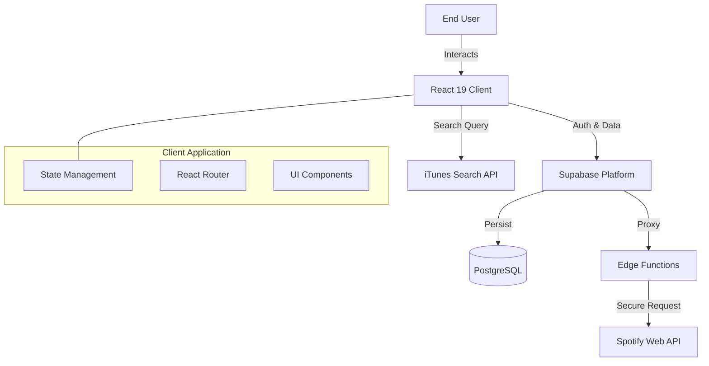

# Music Playlist App (Spotify-like Experience)

[](https://github.com/sirawichz/Music_playlist)
[](https://opensource.org/licenses/MIT)
[](https://react.dev)
[](https://vitejs.dev)
[](https://supabase.com)

> **A scalable, production-ready music playlist management system offering a premium "Spotify-like" user experience.**

---

## � Table of Contents

- [Overview](#-overview)
- [Key Features](#-key-features)
- [Tools & Technologies](#-tools--technologies)
- [System Architecture](#-system-architecture-how-things-work)
- [Setup & Deployment](#-how-to-setup)
  - [With Docker Compose](#with-docker-compose)
  - [With Kubernetes (Helm)](#with-kubernetes-helm)
- [Notes & References](#-notes--references)

---

## 🔭 Overview

In the modern web ecosystem, building a responsive and seamless media application requires a robust architecture that balances client-side performance with secure server-side operations. **Music Playlist App** solves the challenge of fragmented music discovery by integrating the **iTunes Search API** for rapid content retrieval with a **Supabase** backend for persistent user libraries.

Reliability and User Experience are paramount. This system implements **Optimistic UI Updates** to ensure instant feedback during playlist operations and utilizes a **Secure Edge Proxy** pattern to handle external API credentials, mitigating security risks common in SPA architectures.

---

## ✨ Key Features

- **⚡ Instant Search Engine**: Utilizing `lodash.debounce` to efficiently query the iTunes API without hitting rate limits, providing real-time search results and 30-second audio previews.
- **🎧 Seamless Playback Controller**: A global state-managed player (powered by Zustand 5) that maintains playback continuity across route navigations/page changes.
- **📂 Smart Library Management**: Full CRUD capabilities (Create, Read, Update, Delete) with Optimistic UI updates, ensuring a "native-app" responsiveness even on slower networks.
- **🛡️ Secure Edge Gateway**: Sensitive operations and token exchanges are offloaded to Supabase Edge Functions, preventing Client Secret exposure.

---

## 🛠 Tools & Technologies

| Category | Technologies |
|----------|--------------|
| **Core** |    |
| **Styling** |   |
| **State** |  |
| **Backend** |   |
| **DevOps** |   |

---

## 🏗 System Architecture (How things work)

The system follows a modern **Client-Serverless** architecture. The React frontend interacts directly with high-performance public APIs (iTunes) for read-only ephemeral data, while user-specific state flows through Supabase.



**Data Flow:**
1. **Discovery**: User types in search bar -> **Debounced Request** (300ms) -> **iTunes API** -> Search Results Display.
2. **Playback**: User clicks play -> **Audio Player Store** (Zustand) Update -> HTML5 Audio Element matches URL streaming.
3. **Curation**: User adds song -> **Optimistic UI Update** (Immediate Feedback) -> **Supabase API Call** -> DB Persistence.

---

## ⚙️ How to Setup

### Prerequisites
- Docker & Docker Compose
- Node.js v20+ (for local development)
- Supabase Project Credentials

### With Docker Compose

Easily spin up the frontend application in a containerized environment.

1. **Build and Run:**
   ```bash
   docker-compose up --build -d
   ```

2. **Verify Deployment:**
   Access the application at `http://localhost:5173`.

3. **Cleanup:**
   ```bash
   docker-compose down --rmi local
   ```

### With Kubernetes (Helm)

Deploy to a cluster using a standard Helm chart structure.

1. **Install Dependencies:**
   ```bash
   helm dependency update ./chart
   ```

2. **Deploy Release:**
   ```bash
   helm install music-playlist ./chart \
     --set service.type=LoadBalancer \
     --set env.VITE_SUPABASE_URL=your_url \
     --set env.VITE_SUPABASE_ANON_KEY=your_key
   ```

3. **Cleanup:**
   ```bash
   helm uninstall music-playlist
   ```

---

## 📝 Notes & References

- **Design Philosophy**: Based on "Glassmorphism" principles and Spotify's dark mode aesthetics for reduced eye strain and premium feel.
- **Supabase Edge Functions**: Utilized for handling CORS and API secrets securely, adhering to the "Backend for Frontend" (BFF) pattern capabilities.
- **Future Roadmap**:
  - [ ] Implementation of full Spotify OAuth 2.0 flow.
  - [ ] Collaborative playlists via Supabase Realtime subscriptions.

**References:**
- [React 19 Documentation](https://react.dev/)
- [Supabase Architecture Guide](https://supabase.com/docs/guides/architecture)
- [Vite High Performance Guide](https://vitejs.dev/guide/performance.html)